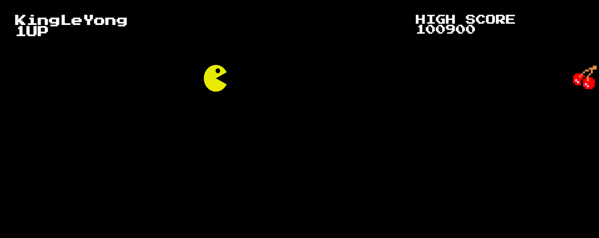

# PACMAN JAVASCRIPT PROJECT

Welcome to my first GitHub javascript project! This is a beginner-friendly animation of Pac-Man using HTML, CSS, and JavaScript. In this project, I've created a simple Pac-Man character that moves across the screen, simulating the classic arcade animation.

## Screenshots




## Languages

- HTML Structure: Sets up the basic layout and elements needed for the Pac-Man animation.
- CSS Styling: Creates Pac-Man's look and feel, with a simple animation effect to mimic his chomping movement.
- JavaScript Logic: Manages Pac-Man’s movement and the animation loop to keep him "eating" along the screen.

## Contact

[Linkedin](https://www.linkedin.com/in/christopher-schol-658211223/)


## Code Exemple

```javascript
let pacman = document.getElementById("pacman");
```